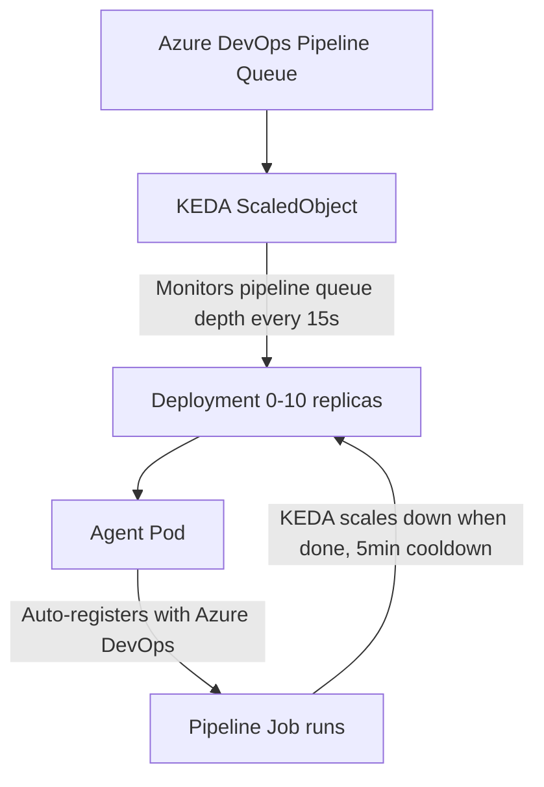

# Kubernetes Self-Hosted Azure DevOps Agents with KEDA Autoscaling

KEDA-based autoscaling self-hosted agent infrastructure for running your Azure DevOps pipelines on Kubernetes.

## Architecture



## Project Structure

```
Kubernetes_as_Azure_Agent/
├── images/
│   ├── base/
│   │   ├── Dockerfile                # Minimal base image (agent requirements only)
│   │   └── agent_installation.sh     # Agent bootstrap & Azure DevOps registration
│   ├── go/
│   │   └── Dockerfile                # Go + Node + Python + Azure CLI (multi-stage)
│   ├── node/
│   │   └── Dockerfile                # Node + Python + Azure CLI (multi-stage)
│   └── github/                       # GitHub Actions runner (glibc/Debian base)
│       ├── Dockerfile
│       └── runner_installation.sh    # Runner bootstrap & GitHub registration
├── k8s/
│   ├── base/
│   │   ├── namespace.yml             # Namespace definition
│   │   └── secret.yml                # PAT Secret & KEDA TriggerAuthentication
│   ├── go/
│   │   └── deployment.yml            # Go agent Deployment + KEDA ScaledObject
│   ├── node/
│   │   └── deployment.yml            # Node agent Deployment + KEDA ScaledObject
│   └── github/
│       └── deployment.yml            # GitHub runner Deployment + KEDA github-runner
├── charts/
│   └── azure-devops-agent/           # Helm chart (Azure agents + GitHub runners)
│       ├── Chart.yaml
│       ├── values.yaml               # Default values
│       ├── values-dev.yaml           # Dev environment overrides
│       ├── values-prod.yaml          # Prod environment overrides
│       └── templates/
│           ├── _helpers.tpl
│           ├── secret.yaml
│           ├── deployment.yaml
│           ├── scaledobject.yaml
│           ├── github-secret.yaml
│           ├── github-deployment.yaml
│           └── github-scaledobject.yaml
├── pipelines/                        # Azure DevOps pipelines
│   ├── build-agent.yml               # Agent image build & deploy pipeline
│   └── test-pipeline.yml             # Example test pipeline
├── .github/
│   └── workflows/                    # GitHub Actions workflows
│       ├── build-runner.yml          # Runner image build & push to GHCR
│       └── test-runner.yml           # Self-hosted runner smoke test
└── README.md
```

## Prerequisites

- Azure Kubernetes Service (AKS) cluster
- KEDA installed on the cluster:
  ```bash
  helm repo add kedacore https://kedacore.github.io/charts
  helm install keda kedacore/keda --namespace keda --create-namespace
  ```
- Azure Container Registry (ACR) and an `acr-secret` ImagePullSecret bound to AKS
- Azure DevOps organization and a PAT with **Agent Pool (Read & Manage)** permission
- Local: Docker, kubectl, Azure CLI
- *(GitHub runners, optional)* a GitHub PAT with **`admin:org`** scope (org runners) or **`repo`** scope (repo runners)

## Quick Start

### 1. Clone the repo

```bash
git clone https://github.com/Cenkay1/Kubernetes_as_Azure_Agent.git
cd Kubernetes_as_Azure_Agent
```

### 2. Build & push Docker images

```bash
# Copy the shared script into the image folder
cp images/base/agent_installation.sh images/go/

# Go agent
docker build -t myacr.azurecr.io/gokubeagent:v1.0.0 images/go/
docker push myacr.azurecr.io/gokubeagent:v1.0.0

# Node agent
cp images/base/agent_installation.sh images/node/
docker build -t myacr.azurecr.io/nodekubeagent:v1.0.0 images/node/
docker push myacr.azurecr.io/nodekubeagent:v1.0.0
```

### 3. Deploy with Helm (Recommended)

```bash
# Dev environment
helm install azure-agents charts/azure-devops-agent \
  -f charts/azure-devops-agent/values-dev.yaml \
  -n azure-agents --create-namespace

# Prod environment
helm install azure-agents charts/azure-devops-agent \
  -f charts/azure-devops-agent/values-prod.yaml \
  -n azure-agents --create-namespace

# Or with inline values
helm install azure-agents charts/azure-devops-agent \
  -n azure-agents --create-namespace \
  --set azureDevOps.url="https://dev.azure.com/myorg" \
  --set azureDevOps.pat="your-pat" \
  --set azureDevOps.poolName="MyKubePool" \
  --set image.registry="myacr.azurecr.io"
```

#### Upgrade & uninstall

```bash
# After updating the values
helm upgrade azure-agents charts/azure-devops-agent \
  -f charts/azure-devops-agent/values-prod.yaml \
  -n azure-agents

# Full uninstall
helm uninstall azure-agents -n azure-agents
```

### Alternative: manual deploy with kubectl

<details>
<summary>If you don't want to use Helm</summary>

Fill in the placeholders in the YAML files under `k8s/`:

| Placeholder | Description | Example |
|---|---|---|
| `<CONTAINER_REGISTRY>` | ACR URL | `myacr.azurecr.io` |
| `<IMAGE_TAG>` | Image tag | `v1.0.0` |
| `<AGENT_POOL_NAME>` | Azure DevOps pool name | `MyKubePool` |
| `<AZURE_DEVOPS_ORG_URL>` | Organization URL | `https://dev.azure.com/myorg` |
| `<BASE64_ENCODED_PAT>` | base64 PAT | `echo -n "pat" \| base64` |

```bash
kubectl apply -f k8s/base/
kubectl apply -f k8s/go/deployment.yml
kubectl apply -f k8s/node/deployment.yml
```

</details>

### 4. Verification

```bash
# Check that the pods are running
kubectl get pods -n azure-agents

# Check the KEDA ScaledObject status
kubectl get scaledobject -n azure-agents

# Follow agent logs
kubectl logs -f -l agent-type=go -n azure-agents

# Helm release status
helm status azure-agents -n azure-agents
```

## CI/CD Pipeline (Azure DevOps)

Instead of building and deploying manually, use the pipelines under `pipelines/`:

- **`build-agent.yml`** — builds the selected agent image, pushes it to ACR, then deploys the manifests under `k8s/` to AKS. Runtime parameters let you pick the agent type (`go` / `node`) and the variable group.
- **`test-pipeline.yml`** — a sample job that targets a tagged agent and prints the installed toolchain versions.

The variable group selected by `build-agent.yml` (`goonly` / `nodeonly`) must define:

| Variable | Description | Example |
|---|---|---|
| `buildPoolName` | Pool that runs the build pipeline itself | `Azure Pipelines` |
| `dockerRegistryServiceConnection` | ACR service connection name | `acr-connection` |
| `imageRepository` | Image repository name | `gokubeagent` |
| `kubernetesConnection` | Kubernetes service connection name | `aks-connection` |
| `CONTAINER_REGISTRY` | ACR login server | `myacr.azurecr.io` |
| `AGENT_POOL_NAME` | Azure DevOps pool the agents register into | `MyKubePool` |
| `AZURE_DEVOPS_ORG_URL` | Organization URL | `https://dev.azure.com/myorg` |
| `BASE64_ENCODED_PAT` | base64-encoded PAT (**mark as secret**) | `echo -n "pat" \| base64` |

The deploy stage replaces the `<...>` placeholders in the manifests with these variables (via `replacetokens`) before applying them.

## Features

### KEDA Autoscaling
- **Min replicas:** 0 (consumes no resources when idle)
- **Max replicas:** 10
- **Polling interval:** 15 seconds (queue check frequency)
- **Cooldown:** 300 seconds (wait before scale-down)
- Pods are created automatically when jobs are waiting in the queue

### Agent Tagging
By tagging agents with different runtimes within the same pool, you can route pipelines to specific agents:

```yaml
pool:
  name: MyKubePool
  demands:
    - TAG_VALUE -equals goonly
```

### Security
- The PAT value is stored in a Kubernetes Secret and injected into the Deployment via `secretKeyRef`
- Liveness/Readiness probes monitor agent health
- Resource requests/limits are defined (resource consumption is kept under control)

## Adding a New Agent Type

1. Create `images/<new-type>/Dockerfile` (add the required runtime)
2. Define the new agent in `values.yaml`:
   ```yaml
   agents:
     python:
       enabled: true
       image: pythonkubeagent
       tag: v1.0.0
       tagValue: "pythononly"
       resources:
         requests:
           cpu: "500m"
           memory: "512Mi"
         limits:
           cpu: "2"
           memory: "2Gi"
   ```
3. Build & push the image
4. Deploy with `helm upgrade` - Helm automatically creates the new Deployment and ScaledObject

## GitHub Actions Runners (parallel variant)

The same pattern (Kubernetes Deployment + KEDA scale-to-zero) also runs **GitHub Actions self-hosted runners**, side by side with the Azure DevOps agents. The infrastructure is shared; only the runner binary, registration flow and KEDA scaler differ.

### How it differs from the Azure agents

| Concern | Azure DevOps | GitHub Actions |
|---|---|---|
| Runner binary | Azure Pipelines agent (Alpine/musl) | `actions/runner` (Debian/glibc) |
| Registration | PAT used directly | Short-lived **registration token** minted at startup from a PAT |
| Deregistration | `config.sh remove` | `--ephemeral` (auto) + remove-token fallback |
| KEDA scaler | `azure-pipelines` | `github-runner` |
| Job routing | `demands: TAG_VALUE -equals goonly` | `runs-on: [self-hosted, linux, k8s]` |

> **Why a different base image?** GitHub only publishes `actions/runner` for glibc (`linux-x64`), so [images/github/Dockerfile](images/github/Dockerfile) uses Debian instead of the Alpine base used by the Azure agents.

### Ephemeral runners

Runners are configured with `--ephemeral` (default): each runner picks up **exactly one job**, then exits. Because it runs inside a Deployment, Kubernetes restarts the container with a fresh registration, and KEDA controls how many run in parallel. This gives clean per-job state and is the recommended security posture for self-hosted runners.

### Deploy with Helm

GitHub support is disabled by default. Enable it alongside (or instead of) the Azure agents:

```bash
helm upgrade --install azure-agents charts/azure-devops-agent \
  -n azure-agents --create-namespace \
  --set image.registry="ghcr.io/myorg" \
  --set github.enabled=true \
  --set github.owner="myorg" \
  --set github.runnerScope="org" \
  --set github.pat="your-github-pat"
```

Or in a values file:

```yaml
image:
  registry: ghcr.io/myorg

github:
  enabled: true
  owner: myorg
  runnerScope: org        # org | repo | ent
  pat: your-github-pat
  ephemeral: true
  runners:
    default:
      enabled: true
      image: githubkuberunner
      tag: latest
      labels: "self-hosted,linux,k8s"
```

### Alternative: kubectl

<details>
<summary>Raw manifests</summary>

Fill in the placeholders in [k8s/github/deployment.yml](k8s/github/deployment.yml):

| Placeholder | Description | Example |
|---|---|---|
| `<CONTAINER_REGISTRY>` | Registry URL | `ghcr.io/myorg` |
| `<IMAGE_TAG>` | Image tag | `v1.0.0` |
| `<GITHUB_OWNER>` | Org (or repo owner) | `myorg` |
| `<RUNNER_LABELS>` | Runner labels | `self-hosted,linux,k8s` |
| `<BASE64_ENCODED_GH_PAT>` | base64 PAT | `echo -n "pat" \| base64` |

```bash
kubectl apply -f k8s/base/namespace.yml
kubectl apply -f k8s/github/deployment.yml
```

</details>

### Build the runner image

- **GitHub Actions:** [.github/workflows/build-runner.yml](.github/workflows/build-runner.yml) builds and pushes the image to GHCR (mirror of the Azure `pipelines/`).
- **Locally:**
  ```bash
  docker build -t ghcr.io/myorg/githubkuberunner:v1.0.0 images/github/
  docker push ghcr.io/myorg/githubkuberunner:v1.0.0
  ```

### ⚠️ Security

Do **not** attach self-hosted runners to **public** repositories — fork pull requests can execute arbitrary code on the runner. Use them only for **private repos / org scope**, keep `--ephemeral` enabled, and isolate them on a dedicated node pool.

> For large-scale production setups, GitHub's official [Actions Runner Controller (ARC)](https://github.com/actions/actions-runner-controller) is also worth evaluating; this variant keeps parity with the Azure setup using the same KEDA-based approach.
